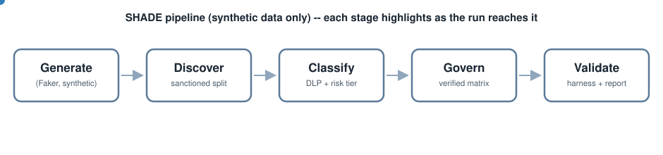
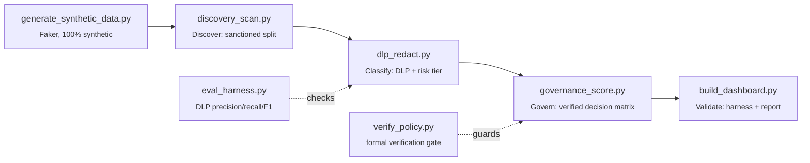
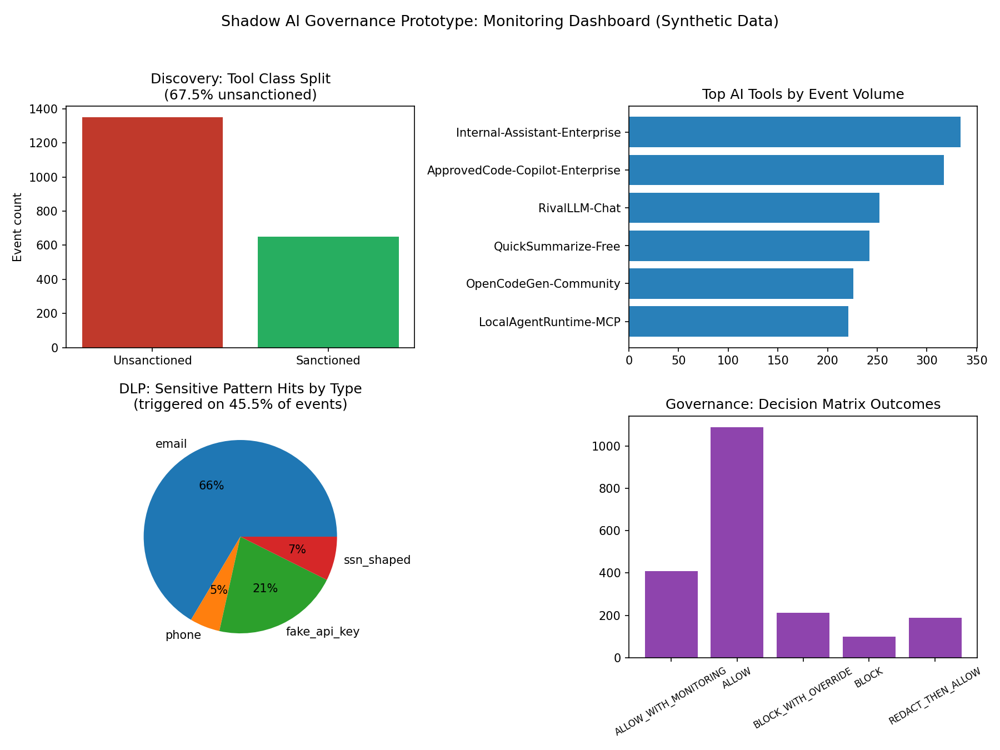

# Project SHADE

**Shadow Hunt, Assess, Decide, Enforce**

*"Mastering the shadows"*

[](https://github.com/Zartharas/SHADE/actions/workflows/test.yml)
[](LICENSE)
[](requirements.txt)
[](#quick-start)

SHADE is an offline prototype for the Shadow AI governance framework
developed in the companion paper, *"Governing Unseen Knowledge: A Practical
Framework for Discovering, Classifying, and Managing Shadow AI as an
Organizational Knowledge Risk"* (paper Section 8).

This is a local, offline, dependency-light demonstration of the
Discover → Classify → Govern → Validate framework described in the paper.
It runs entirely on synthetic data generated with [Faker](https://github.com/joke2k/faker)
and makes no network calls, no cloud dependencies, and uses no real
organizational, employee, or customer data at any stage.

<p align="center">
  
</p>

<p align="center"><sub>Self-contained animated SVG (no JS, loops automatically) -- if it renders as static in your viewer, the Mermaid diagram below is the same flow as a text-based fallback.</sub></p>



<p align="center">
  
</p>

<p align="center"><sub>Output of <code>python3 run_pipeline.py --n 2000</code> against the reference synthetic dataset (fixed seed). Regenerate anytime — see Quick start below.</sub></p>

## What this is, and isn't

SHADE demonstrates the framework's execution path and checks selected
internal rules; it does not validate production-scale performance or
accuracy against real-world data. It is not a substitute for the real,
production-grade open-source tools cited throughout the paper. Do not
deploy this code as-is against real traffic or real employee data: see
"Production tooling" below.

The software itself can be run without purchasing a commercial license or
paid cloud resource ("zero-budget" in that narrow sense), but local compute,
storage, maintenance, and development time still carry real operational cost.

| SHADE module | Relationship to production tooling | Paper section |
|---|---|---|
| `generate_synthetic_data.py` | N/A: synthetic data generation only | 8.1 |
| `discovery_scan.py` | Reads a generated ground-truth label; does not perform independent detection like Zeek / Suricata (SNI/JA3), AIOStack (eBPF), or agent-discover-scanner | 3, 8.2 |
| `dlp_redact.py` | Regex-only; illustrates the pattern used by aidlp / llmproxy (mitmproxy + Presidio/spaCy) without their ML-based recognition | 5.2, 8.3 |
| `governance_score.py` | Deterministic rule-table lookup, not a stand-in for ML-judge governance tools such as GovLLM or IBM AI Atlas Nexus | 4.4, 8.4 |
| `build_dashboard.py` | Static local visualization; not a substitute for ELK / OpenSearch | 6, 8.5 |

## Layout

```
config/       tool registry (known_endpoints.yaml)
docs/         theory.md, benchmark.md, extensions.md, shadow-ai-vs-shadow-it.md, adr/, example dashboard image
experiments/  eval harness configs + benchmark dataset generator scaffold; experiments/output/ is generated+gitignored
extensions/   optional, standalone prototypes (LLM policy proposer, MCP tool-call monitor, DP reporting) -- not wired into the core pipeline, see docs/extensions.md
output/       generated pipeline artifacts (gitignored; regenerate anytime)
paper/        manuscript/submission drafts (gitignored, local-only)
*.py          the five pipeline phases + orchestrator + verification/eval harness, at repo root
```

- `docs/theory.md` maps SHADE's four stages against NIST AI RMF, ISO/IEC
  42001, and DART's constructs -- including where a mapping is genuine and
  where it isn't.
- `docs/benchmark.md` states exactly what the evaluation harness measures
  and what it doesn't (internal consistency against synthetic ground
  truth, not real-world accuracy).
- `docs/extensions.md` scopes the three optional prototypes in
  `extensions/`: what each demonstrates and, as importantly, what it
  doesn't.
- `docs/shadow-ai-vs-shadow-it.md` is a short comparative note grounded in
  DART and Silic et al. (2025), distinguishing Shadow AI from the older
  Shadow IT category this project's discovery/inventory approach descends
  from.
- `docs/adr/` records the reasoning behind non-obvious design decisions,
  starting with why the governance matrix is verified by exhaustive
  enumeration rather than a SAT/SMT solver.
- `CONTRIBUTING.md` covers the project's hard constraints (synthetic data
  only, offline only, anonymity during review) for anyone touching this
  code, including future changes by the maintainer.

## Quick start

```bash
python3 -m venv venv && source venv/bin/activate
pip install -r requirements.txt        # pinned exact versions; or: pip install -r requirements.txt --break-system-packages
python3 run_pipeline.py --n 2000
```

Or, for an exactly reproducible reference environment:

```bash
docker build -t shade .
docker run --rm -v "$(pwd)/output:/app/output" shade python3 run_pipeline.py --n 2000
```

This produces, in `output/`:

- `synthetic_usage.csv`: the raw synthetic dataset
- `discovery_report.json`: sanctioned/unsanctioned split, top tools, department breakdown
- `redacted_events.csv`, `redaction_report.json`: DLP redaction results
- `scored_events.csv`, `governance_report.json`: governance decision-matrix outcomes
- `dashboard.png`: four-panel visual summary
- `VALIDATION_REPORT.md`: Phase 6 internal-checks summary and explicit limitations (filename retained from earlier drafts; the report documents internal checks and stated limitations, not independent validation)

Each script is also runnable independently: run `python3 <script>.py --help`
for options. `run_pipeline.py` calls each phase's functions directly
in-process rather than shelling out, so there's exactly one implementation
of the discovery/DLP/governance/dashboard logic, shared by the CLI and the
orchestrator.

Run the self-check (formally verifies the governance decision matrix,
checks DLP redaction patterns, and runs the DLP evaluation harness against
its precision/recall/F1 thresholds -- see docs/benchmark.md) with:

```bash
python3 test_pipeline.py
```

The formal verification and evaluation harness can also be run standalone:

```bash
python3 verify_policy.py                                   # governance matrix: completeness + non-conflict
python3 eval_harness.py --n 300 --seed 42                  # DLP: precision/recall/F1 vs. synthetic ground truth
```

## Production tooling (real deployments)

For an actual organizational rollout, replace each SHADE module with the
verified open-source tools cited in the paper:

- **Discovery:** [AIOStack](https://github.com/aurva-io/AIOstack) (Kubernetes/eBPF),
  [agent-discover-scanner](https://github.com/Defend-AI-Tech-Inc/agent-discover-scanner),
  [AI-Detector](https://github.com/shamo0/AI-Detector) (MDM/endpoint),
  [Zeek](https://zeek.org) / [Suricata](https://suricata.io) (network SNI/JA3)
- **DLP:** [aidlp](https://github.com/fabriziosalmi/aidlp),
  [llmproxy](https://github.com/fabriziosalmi/llmproxy),
  [Microsoft Presidio](https://github.com/microsoft/presidio),
  [OpenDLP](https://github.com/ezarko/opendlp), [MyDLP](https://github.com/mydlp/mydlp)
- **Secrets hygiene:** [trufflehog](https://github.com/trufflesecurity/trufflehog),
  [gitleaks](https://github.com/gitleaks/gitleaks)
- **Governance:** [GovLLM](https://github.com/JehanneDussert/govllm),
  [IBM ai-atlas-nexus](https://github.com/IBM/ai-atlas-nexus)
- **Monitoring:** [Elastic (ELK) Stack](https://elastic.co), [OpenSearch](https://opensearch.org)

## Legal and ethical notes

- All data is synthetic. Do not point `generate_synthetic_data.py`'s output
  format at a real data-export pipeline without a full legal/privacy review.
- Deploying TLS-interception (mitmproxy-based) DLP in production requires
  jurisdiction-specific legal review and, in some jurisdictions, works-council
  consultation before enabling content-level inspection. See paper Section 5.4.
- This code is provided for educational/demonstration purposes only.

## License

MIT, see [LICENSE](LICENSE).

## Citing this work

If you use this code or the accompanying paper, see [CITATION.cff](CITATION.cff).
Author identity is currently redacted pending the outcome of double-anonymous
peer review (see the note at the bottom of that file); full attribution will
be restored once a review decision is issued. GitHub renders a
"Cite this repository" button automatically from this file.
