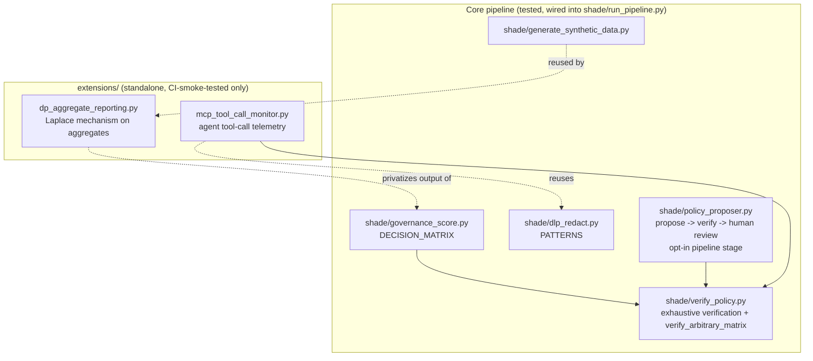

# Optional extensions: scope and status

Three extensions were built after the core project (Phases 1-5), against
the original scoping rule that only one should be attempted, "properly
scoped... not the full research-paper version." That rule was explicitly
overridden by request; all three were implemented as solo-researcher-
scoped prototypes, not as finished, defensible research contributions in
their own right.

**Update:** the LLM policy proposer has since graduated out of this
document -- it's now `shade/policy_proposer.py`, tested by
`tests/test_pipeline.py`, and wired into `shade/run_pipeline.py` as an
opt-in stage. See `docs/adr/0002-integrating-llm-policy-proposer.md` for
that integration decision. The other two remain standalone extensions,
described below, and this document is still the honest accounting of what
each does and doesn't demonstrate. Per the maintainer's stated plan
(integrate one at a time, test, then move to the next), MCP monitoring and
DP reporting are candidates for the same treatment later, each getting its
own ADR when/if that happens.

The remaining two live in `extensions/`, are standalone (importable and
runnable independently), and are **not wired into `shade/run_pipeline.py`
or `tests/test_pipeline.py`** -- they don't change the core pipeline's
documented behavior, and none of their claims should be read as claims
about the core SHADE pipeline itself.

## Graduated: LLM-based dynamic policy generation (now `shade/policy_proposer.py`)

No live LLM API call is made anywhere in this repository -- SHADE is
offline/zero-budget by design, and wiring in a real API would break that
property and cost real money. What's implemented instead: a pluggable
`PolicyProposerBackend` interface with one shipped implementation
(`HeuristicMockBackend`, deterministic and offline) that produces a
plausible-shaped policy proposal, which then passes through a **formal
verification gate** (`shade/verify_policy.py`'s `verify_arbitrary_matrix()`,
generalized to an arbitrary two-axis domain) before being written out as a
candidate for human review. It is never auto-applied to
`shade/governance_score.py` -- this is now a regression-tested property
(`test_policy_proposer_never_mutates_decision_matrix`), not just a design
intent.

**What integration added:** an opt-in `--propose_policy_review` flag on
`shade/run_pipeline.py` that runs the proposer against the run's own
governance action distribution (real pipeline context, not just a
CLI-supplied string), off by default so the documented default output
contract is unchanged. Three tests in `tests/test_pipeline.py`: the normal
case passes verification, a deliberately broken backend is rejected, and
`DECISION_MATRIX` is confirmed byte-identical before/after both.

**What this still does NOT demonstrate, even integrated:** anything about
real LLM policy-proposal quality. That's a separate research question
requiring a real API call and its own evaluation, still explicitly future
work -- integration changed where the module lives and how tested it is,
not what backend it uses.

## 1. Agentic-AI-governance / MCP tool-call monitoring (`extensions/mcp_tool_call_monitor.py`)

Extends SHADE's monitoring concept from chat-tool prompt text to agent
tool-calls (the MCP telemetry shape: server + method + arguments), with
governance decisions based primarily on method-level risk classification
(read/write/execute) rather than only regex-detectable content in
arguments -- reusing `shade/dlp_redact.py`'s patterns as a secondary signal. Uses
a new, separately verified decision matrix
(`method_risk_class x data_sensitivity`), formally checked with the same `shade/verify_policy.py`'s
`verify_arbitrary_matrix()` that `shade/policy_proposer.py` uses,
demonstrating the verification approach generalizes to a second
governance table.

**What this does NOT demonstrate:** session-level or multi-step agent plan
reasoning (an agent chaining several individually-innocuous calls to
achieve a risky effect no single call would trigger) -- a real and harder
problem, explicitly out of scope here. All events are synthetic; no real
MCP server is ever contacted.

## 2. Privacy-preserving detection prototype (`extensions/dp_aggregate_reporting.py`)

Applies the Laplace mechanism (epsilon-differential privacy for count
queries) to SHADE's **aggregate reporting** outputs (governance action
distribution, department-level breakdowns) -- not to the per-event
classification step. That's a deliberate reinterpretation of the original
scoping conversation's "differential privacy on the classification step,"
documented here rather than done silently: `decide()` is a deterministic
lookup over a verified, complete table, so there's no statistical query
there for DP to protect; aggregate count release, where small-group counts
can leak individual-level information, is where the mechanism actually has
something to do.

**What this demonstrates:** a working, correctly-implemented Laplace
mechanism with a measured privacy/utility trade-off (mean absolute error
across four epsilon values on 2000 synthetic events, monotonically
decreasing as epsilon increases, as the mechanism's theory predicts).

**What this does NOT demonstrate:** privacy budget composition across
multiple releases (each run spends a fresh epsilon as if it were the only
query ever made -- a real deployment publishing several differently-sliced
aggregates would need cumulative budget accounting this prototype doesn't
implement), any DP-SGD training mechanism, or federated learning (the
scoping conversation's other listed option, not attempted -- picking both
would have re-violated the "one, properly scoped" principle a second time).

## Common thread

Every module here (graduated or still standalone) reuses rather than
reimplements core-pipeline logic where possible (shade/dlp_redact.py's
patterns, the exhaustive-enumeration verification method from ADR 0001,
shade/generate_synthetic_data.py's event generator) and is explicit about
what it does not claim. Graduating a module changes where it lives and how
rigorously it's tested; it does not, by itself, change what it's actually
been shown to do -- that still has to be earned separately, as the "what
integration added" vs. "what it still does NOT demonstrate" split above
for the policy proposer is meant to make clear.
